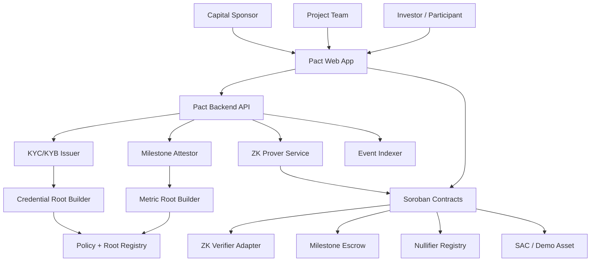
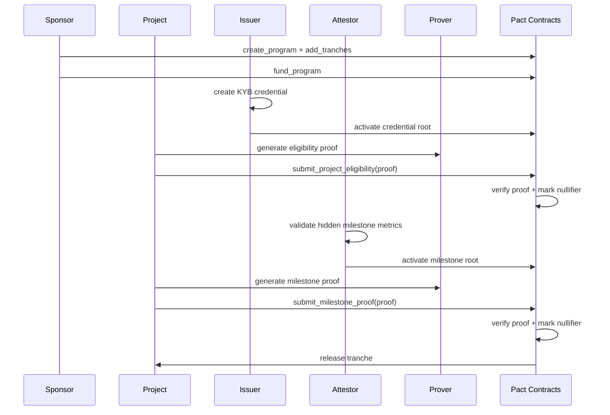

# Pact — Technical Development Document

**Product:** Pact  
**Version:** MVP specification v0.1  
**Core thesis:** private compliance + private milestone proofs + automatic capital release.  
**Target chain:** Stellar / Soroban testnet for MVP.  
**Primary use case:** milestone-based grant or investment escrow with zero-knowledge proof of eligibility and milestone completion.  
**Secondary use case:** gated mint/transfer/redeem for tokenized RWA assets.

---

## 1. Executive Summary

Pact is a privacy-preserving funding and compliance layer for tokenized investments, grants, and RWA programs.

The product allows sponsors, grant providers, investment programs, and RWA issuers to lock funds into an on-chain escrow and release them only when two conditions are proven:

1. **Eligibility / compliance condition:** the investor, project, recipient, or wallet is allowed to participate according to a policy.
2. **Milestone condition:** the project has reached a predefined milestone, proven from attested private data.

Pact reveals the public fact that a policy was satisfied, but hides sensitive source data:

- KYC/KYB documents;
- jurisdiction attributes;
- accredited / non-US status source evidence;
- exact revenue;
- client names;
- contracts;
- internal project metrics;
- impact reports;
- raw auditor documents.

The MVP should not attempt to become a full regulated investment platform. It should prove the missing technical layer:

> **Private proof of eligibility + private proof of performance + automatic capital release.**

---

## 2. Product Positioning

### 2.1 One-liner

**Pact lets capital providers release tokenized funding only when teams privately prove compliance and milestone completion.**

### 2.2 Product description

Pact is a private milestone escrow and compliance gate for tokenized capital. Sponsors create funding programs with predefined milestones. Projects submit zero-knowledge proofs showing that hidden, attested business or impact metrics satisfy the milestone policy. Smart contracts verify the proof and release the next tranche automatically.

For RWA programs, Pact can additionally gate mint, transfer, and redeem actions so only eligible wallets can hold or interact with the asset.

### 2.3 Why this matters

Public blockchains create transparent audit trails, but funding, investing, and RWA compliance often depend on sensitive off-chain data. Projects may need to prove revenue, user growth, audit completion, customer traction, or regulatory eligibility without exposing the raw evidence publicly.

Pact solves this by separating:

- **public accountability:** proof verified, policy hash, milestone id, tranche released;
- **private evidence:** exact metrics, documents, KYC/KYB attributes, source files.

---

## 3. MVP Scope

### 3.1 MVP product name

**Pact MVP: Private Milestone Escrow**

### 3.2 MVP goal

Build a working testnet demo where:

1. a sponsor creates a funding program;
2. funds are locked into an escrow contract;
3. a project proves eligibility through a ZK compliance proof;
4. the project submits a private milestone proof;
5. the contract verifies the proof;
6. a tranche is released automatically;
7. replay, expired credential, and revoked credential attempts are rejected.

### 3.3 MVP in-scope

- Policy registry with active policy hashes.
- Active KYC/KYB root registry.
- Root rotation to simulate revocation.
- Nullifier registry to block replay.
- Milestone escrow contract.
- Testnet asset transfer using XLM or a demo issued asset through SAC.
- Two ZK circuits:
  - `EligibilityProof`;
  - `MilestoneUnlockProof`.
- Off-chain mock KYC/KYB issuer.
- Off-chain mock milestone attestor.
- Proof generation service.
- Web dashboard for sponsor, project, issuer, and public audit view.
- Demo attack simulation.

### 3.4 MVP out-of-scope

- Real legal investment offering.
- Real accredited investor verification.
- Real KYC provider integration.
- Mainnet launch.
- Custody, fiat ramps, or broker-dealer workflows.
- Secondary RWA marketplace.
- Fully production-grade revocation accumulators.
- Fully production-grade zkTLS data source proofs.
- Fully private wallet graph hiding.

---

## 4. Product Roles

### 4.1 Sponsor

A grant provider, investor, foundation, DAO, NGO, accelerator, or RWA funding program that creates a funding program and deposits capital.

Sponsor actions:

- create program;
- define tranche schedule;
- define milestone policies;
- fund escrow;
- inspect proof audit trail;
- optionally dispute a milestone during a dispute window in later versions.

### 4.2 Project / Team

The recipient of milestone-based funding.

Project actions:

- pass KYB / eligibility check;
- submit private data to attestor;
- generate milestone proof;
- submit proof on-chain;
- receive tranche.

### 4.3 Investor / Participant

An eligible party that can fund, buy, hold, transfer, or redeem a tokenized asset.

Investor actions:

- pass KYC;
- generate eligibility proof;
- interact with gated asset or funding program.

### 4.4 KYC/KYB Issuer

A trusted off-chain entity that validates identity, jurisdiction, sanctions, accredited/non-US status, or project eligibility.

Issuer actions:

- issue credential commitments;
- publish active root;
- rotate roots;
- revoke credentials by excluding them from the active tree;
- sign metadata.

### 4.5 Milestone Attestor

A trusted off-chain entity that validates milestone evidence.

Attestor actions:

- ingest hidden project evidence;
- validate source files or mock integrations;
- publish attested metric root;
- sign attestation bundle.

### 4.6 Public Observer

Anyone who can verify that Pact released funds according to a known policy hash without seeing confidential data.

---

## 5. Core Architecture

Pact is split into four layers:

1. **On-chain contracts** — policy registry, root registry, nullifier registry, milestone escrow, verifier adapter.
2. **ZK layer** — circuits, witness generation, proof generation, verification key management.
3. **Off-chain attestation layer** — KYC/KYB issuer, milestone attestor, root builder, proof API.
4. **Application layer** — web dashboard, wallet integration, demo console, event indexer.



---

## 6. On-chain Design

### 6.1 Contract list for MVP

The MVP should contain these contracts:

1. `PolicyRegistry`
2. `RootRegistry`
3. `NullifierRegistry`
4. `VerifierAdapter`
5. `MilestoneEscrow`
6. optional `GatedAssetController`

For the first MVP build, `VerifierAdapter` can support both:

- a `MockVerifier` mode for early contract integration tests;
- a `Groth16Verifier` mode for final demo.

### 6.2 PolicyRegistry

Stores policy versions and their lifecycle.

#### Responsibilities

- Create policy.
- Activate/deactivate policy.
- Map policy id to policy hash.
- Bind policies to program ids, market ids, action types, and verifier contracts.
- Enforce admin authorization.

#### Storage

```rust
Policy {
    policy_id: BytesN<32>,
    policy_hash: BytesN<32>,
    policy_type: PolicyType, // Eligibility | Milestone | AssetAction
    status: PolicyStatus,   // Active | Paused | Deprecated
    issuer: Address,
    verifier: Address,
    valid_from: u64,
    valid_until: u64,
    created_at: u64,
}
```

#### Main methods

```rust
create_policy(policy_id, policy_hash, policy_type, verifier, valid_from, valid_until)
activate_policy(policy_id)
pause_policy(policy_id)
deprecate_policy(policy_id)
get_policy(policy_id) -> Policy
is_policy_active(policy_id, policy_hash, now) -> bool
```

#### Events

```rust
PolicyCreated(policy_id, policy_hash, policy_type, issuer)
PolicyStatusChanged(policy_id, old_status, new_status)
PolicyVerifierUpdated(policy_id, verifier)
```

---

### 6.3 RootRegistry

Stores active roots for credentials and milestone attestations.

#### Responsibilities

- Store active KYC/KYB roots.
- Store active milestone data roots.
- Rotate roots.
- Enforce root epoch windows.
- Deactivate roots to simulate revocation.

#### Storage

```rust
RootRecord {
    root: BytesN<32>,
    policy_id: BytesN<32>,
    root_type: RootType, // Credential | MilestoneMetrics | Revocation
    epoch: u64,
    status: RootStatus, // Active | Inactive
    valid_from: u64,
    valid_until: u64,
    issuer: Address,
}
```

#### Main methods

```rust
activate_root(policy_id, root, root_type, epoch, valid_from, valid_until)
deactivate_root(policy_id, root)
is_root_active(policy_id, root, root_type, now) -> bool
get_current_root(policy_id, root_type) -> RootRecord
```

#### Events

```rust
RootActivated(policy_id, root, root_type, epoch, valid_until)
RootDeactivated(policy_id, root, root_type, epoch)
```

---

### 6.4 NullifierRegistry

Prevents replay of credentials and milestone proofs.

#### Responsibilities

- Store used nullifiers.
- Bind nullifier usage to action, program, and milestone.
- Expose reusable verification to other contracts.

#### Storage

```rust
NullifierRecord {
    nullifier: BytesN<32>,
    used_for: BytesN<32>,
    used_at: u64,
}
```

#### Main methods

```rust
is_used(nullifier) -> bool
mark_used(nullifier, used_for)
assert_unused(nullifier)
```

#### Events

```rust
NullifierUsed(nullifier, used_for, used_at)
```

---

### 6.5 VerifierAdapter

Abstracts proof verification.

#### Responsibilities

- Accept proof bytes and public inputs.
- Route verification to the correct verifier implementation.
- Return true/false to caller contracts.

#### MVP modes

```rust
VerifierMode::Mock
VerifierMode::Groth16Bn254
```

#### Main methods

```rust
verify_eligibility(proof, public_inputs) -> bool
verify_milestone(proof, public_inputs) -> bool
```

#### Public input structs

```rust
EligibilityPublicInputs {
    policy_hash: BytesN<32>,
    root: BytesN<32>,
    nullifier: BytesN<32>,
    market_id: BytesN<32>,
    asset_id: BytesN<32>,
    action_type: Symbol,
    account: Address,
    current_epoch: u64,
}
```

```rust
MilestonePublicInputs {
    policy_hash: BytesN<32>,
    milestone_root: BytesN<32>,
    nullifier: BytesN<32>,
    program_id: BytesN<32>,
    milestone_id: BytesN<32>,
    recipient: Address,
    tranche_amount: i128,
    current_epoch: u64,
}
```

---

### 6.6 MilestoneEscrow

The core MVP contract.

#### Responsibilities

- Create funding program.
- Accept sponsor funding.
- Store tranches.
- Verify milestone proofs.
- Release tranche automatically after proof verification.
- Prevent double release.
- Emit public audit events.

#### Storage

```rust
Program {
    program_id: BytesN<32>,
    sponsor: Address,
    project: Address,
    asset: Address,
    total_amount: i128,
    funded_amount: i128,
    status: ProgramStatus, // Draft | Funded | Active | Completed | Paused | Cancelled
    eligibility_policy_id: BytesN<32>,
    created_at: u64,
}
```

```rust
Tranche {
    program_id: BytesN<32>,
    milestone_id: BytesN<32>,
    milestone_policy_id: BytesN<32>,
    amount: i128,
    status: TrancheStatus, // Locked | Released | Failed | Disputed
    release_to: Address,
    released_at: Option<u64>,
}
```

#### Main methods

```rust
create_program(program_id, project, asset, total_amount, eligibility_policy_id)
add_tranche(program_id, milestone_id, milestone_policy_id, amount, release_to)
fund_program(program_id, amount)
activate_program(program_id)
submit_project_eligibility(program_id, proof, public_inputs)
submit_milestone_proof(program_id, milestone_id, proof, public_inputs)
release_tranche(program_id, milestone_id)
pause_program(program_id)
cancel_program(program_id)
```

#### Release logic

```text
submit_milestone_proof checks:
1. program is active;
2. tranche exists and is locked;
3. milestone policy is active;
4. milestone root is active;
5. nullifier is unused;
6. proof is valid;
7. public recipient equals tranche release_to;
8. public amount equals tranche amount;
9. proof is bound to program_id and milestone_id.

If all checks pass:
- mark nullifier as used;
- mark tranche as released;
- transfer funds from escrow to recipient;
- emit TrancheReleased event.
```

#### Events

```rust
ProgramCreated(program_id, sponsor, project, asset, total_amount)
ProgramFunded(program_id, amount, funded_amount)
ProjectEligibilityVerified(program_id, project, policy_hash, nullifier)
MilestoneProofVerified(program_id, milestone_id, policy_hash, milestone_root, nullifier)
TrancheReleased(program_id, milestone_id, recipient, amount, asset)
ProgramCompleted(program_id)
```

---

### 6.7 Optional GatedAssetController

For the MVP, this should be a secondary module, not the main demo.

#### Responsibilities

- Gate `mint`, `transfer`, and `redeem` actions behind eligibility proof.
- Demonstrate RWA compliance use case.
- Prevent transfer to ineligible recipients.

#### Main methods

```rust
gated_mint(to, amount, proof, public_inputs)
gated_transfer(from, to, amount, recipient_proof, public_inputs)
gated_redeem(from, amount, proof, public_inputs)
```

#### Important design constraint

If the asset can be transferred outside the controller, the gate can be bypassed. For the MVP, keep the asset in escrow / contract-controlled flow. For a regulated production asset, use issuer-level authorization controls or a contract-controlled position token.

---

## 7. ZK Design

### 7.1 ZK primitives

MVP circuit stack:

- Circom or Noir for circuits;
- Groth16 proof system for first implementation;
- BN254 curve;
- Poseidon hash for commitments, Merkle leaves, Merkle roots, and nullifiers;
- snarkjs or equivalent tooling for local proving pipeline.

### 7.2 Circuit 1 — EligibilityProof

Proves that a wallet has an active credential satisfying a policy without revealing raw credential attributes.

#### Private inputs

```text
credential_secret
credential_salt
subject_id
jurisdiction_code
is_accredited
is_non_us
sanctions_passed
expires_at
issuer_id
merkle_path_elements
merkle_path_indices
```

#### Public inputs

```text
policy_hash
credential_root
nullifier
market_id
asset_id
action_type
account_hash or account binding
current_epoch
```

#### Constraints

```text
1. credential_leaf = Poseidon(subject_commitment, attributes, expires_at, issuer_id, salt)
2. credential_leaf is included in credential_root
3. sanctions_passed == 1
4. expires_at > current_epoch
5. policy rule passes:
   - accredited == 1 OR non_us == 1 for MVP policy
   - jurisdiction belongs to allowed group for jurisdiction policy
6. nullifier = Poseidon(credential_secret, chain_id, contract_id, market_id, asset_id, action_type)
7. account binding is valid
```

#### MVP policy examples

```text
Policy A: accredited_or_non_us
- sanctions_passed == true
- expires_at > current_epoch
- is_accredited == true OR is_non_us == true
```

```text
Policy B: allowed_jurisdiction
- sanctions_passed == true
- expires_at > current_epoch
- jurisdiction_group == allowed
```

#### Public result

```text
eligible = true
```

No raw credential data is published.

---

### 7.3 Circuit 2 — MilestoneUnlockProof

Proves that hidden project metrics satisfy a milestone policy.

#### Private inputs

```text
project_secret
metric_values
metric_salts
attestation_secret
merkle_path_elements
merkle_path_indices
```

Example private metric values:

```text
active_users = 735
pilot_partners = 4
audit_passed = 1
fraud_rate_bps = 120
mrr_usd = 12600
```

#### Public inputs

```text
policy_hash
milestone_root
nullifier
program_id
milestone_id
recipient
tranche_amount
current_epoch
```

#### Constraints

```text
1. metric_commitment = Poseidon(metric_name, metric_value, metric_salt, attestor_id)
2. metric_commitment is included in milestone_root
3. active_users >= policy.threshold_users
4. pilot_partners >= policy.threshold_partners
5. audit_passed == 1
6. fraud_rate_bps <= policy.max_fraud_bps, if used
7. mrr_usd >= policy.min_mrr, if used
8. nullifier = Poseidon(project_secret, program_id, milestone_id)
9. recipient and tranche_amount match public inputs
```

#### MVP milestone policy

```text
M1:
- active_users >= 500
- pilot_partners >= 3
- audit_passed == true
```

#### Public result

```text
milestone_reached = true
```

Exact metric values remain hidden.

---

### 7.4 Nullifier rules

Eligibility proof nullifier:

```text
Poseidon(
  credential_secret,
  chain_id,
  contract_id,
  market_id,
  asset_id,
  action_type
)
```

Milestone proof nullifier:

```text
Poseidon(
  project_secret,
  program_id,
  milestone_id
)
```

This prevents:

- reusing a proof across markets;
- reusing a proof across assets;
- reusing a proof for a different action;
- claiming the same milestone twice;
- replaying an old proof after root rotation.

---

## 8. Off-chain Services

### 8.1 Backend API

Recommended stack:

- Node.js + TypeScript;
- Express, Fastify, or NestJS;
- PostgreSQL;
- Redis for job queue/cache;
- BullMQ or similar for proof jobs;
- Prisma or Drizzle ORM;
- Stellar SDK for transaction creation and contract reads/writes.

### 8.2 KYC/KYB Issuer Service

For MVP this is a mock issuer that simulates a trusted compliance provider.

#### Responsibilities

- Create mock credentials.
- Build credential Merkle tree.
- Publish root to contract.
- Rotate root when credentials are revoked.
- Provide private credential package to user for local/prover proof generation.

#### Credential schema

```json
{
  "credential_id": "cred_001",
  "subject_commitment": "0x...",
  "wallet": "G...",
  "issuer_id": "PACT_KYC_MOCK_ISSUER",
  "is_accredited": true,
  "is_non_us": false,
  "jurisdiction_group": "allowed",
  "sanctions_passed": true,
  "issued_at": 1783000000,
  "expires_at": 1785600000,
  "salt": "0x...",
  "credential_secret": "0x..."
}
```

Only the commitment leaf and root are used publicly.

### 8.3 Milestone Attestor Service

For MVP this service simulates an auditor or data attestor.

#### Responsibilities

- Accept hidden milestone evidence.
- Validate mock data.
- Build metric commitments.
- Publish milestone root.
- Create proof input package.

#### Milestone evidence schema

```json
{
  "program_id": "program_001",
  "milestone_id": "M1",
  "project_wallet": "G...",
  "metrics": {
    "active_users": 735,
    "pilot_partners": 4,
    "audit_passed": 1
  },
  "source_refs": [
    "mock_stripe_report_001",
    "mock_github_release_001",
    "mock_auditor_letter_001"
  ],
  "attestor_id": "PACT_MILESTONE_ATTESTOR",
  "attested_at": 1783000000
}
```

### 8.4 Prover Service

For MVP, proofs can be generated server-side for demo speed. A stronger privacy version should move witness generation to the browser or local client.

#### Responsibilities

- Generate witness.
- Generate proof.
- Format public inputs for contract call.
- Return proof payload to frontend.

#### Endpoints

```text
POST /api/proofs/eligibility/generate
POST /api/proofs/milestone/generate
GET  /api/proofs/jobs/:jobId
```

### 8.5 Event Indexer

Stores contract events for the dashboard.

#### Responsibilities

- Poll Stellar RPC / event API.
- Decode events.
- Store events in PostgreSQL.
- Display public audit trail.

#### Indexed event tables

```text
policy_events
root_events
program_events
milestone_events
tranche_events
nullifier_events
```

---

## 9. Backend API Specification

### 9.1 Program APIs

```text
POST /api/programs
GET  /api/programs/:programId
POST /api/programs/:programId/fund
POST /api/programs/:programId/activate
GET  /api/programs/:programId/audit
```

### 9.2 Policy APIs

```text
POST /api/policies
GET  /api/policies/:policyId
POST /api/policies/:policyId/activate
POST /api/policies/:policyId/pause
```

### 9.3 Issuer APIs

```text
POST /api/issuer/credentials/mock
POST /api/issuer/roots/build
POST /api/issuer/roots/publish
POST /api/issuer/credentials/:credentialId/revoke
```

### 9.4 Attestor APIs

```text
POST /api/attestor/milestone-evidence/mock
POST /api/attestor/milestone-root/build
POST /api/attestor/milestone-root/publish
GET  /api/attestor/programs/:programId/milestones/:milestoneId
```

### 9.5 Proof APIs

```text
POST /api/proofs/eligibility/generate
POST /api/proofs/milestone/generate
POST /api/proofs/milestone/submit
GET  /api/proofs/:proofId
```

---

## 10. Database Model

### 10.1 Core tables

```sql
programs (
  id uuid primary key,
  program_key text unique,
  sponsor_wallet text,
  project_wallet text,
  asset_contract text,
  total_amount numeric,
  funded_amount numeric,
  status text,
  eligibility_policy_id text,
  created_at timestamp,
  updated_at timestamp
)
```

```sql
tranches (
  id uuid primary key,
  program_id uuid references programs(id),
  milestone_key text,
  milestone_policy_id text,
  amount numeric,
  release_to_wallet text,
  status text,
  released_at timestamp,
  tx_hash text
)
```

```sql
policies (
  id uuid primary key,
  policy_key text unique,
  policy_hash text,
  policy_type text,
  status text,
  raw_policy_json jsonb,
  created_at timestamp,
  updated_at timestamp
)
```

```sql
roots (
  id uuid primary key,
  policy_id uuid references policies(id),
  root text,
  root_type text,
  epoch integer,
  status text,
  tx_hash text,
  valid_from timestamp,
  valid_until timestamp,
  created_at timestamp
)
```

```sql
credentials (
  id uuid primary key,
  credential_key text unique,
  wallet text,
  subject_commitment text,
  issuer_id text,
  credential_leaf text,
  status text,
  expires_at timestamp,
  created_at timestamp
)
```

```sql
milestone_attestations (
  id uuid primary key,
  program_id uuid references programs(id),
  milestone_key text,
  milestone_root text,
  private_metrics_encrypted text,
  public_policy_hash text,
  attestor_id text,
  status text,
  tx_hash text,
  created_at timestamp
)
```

```sql
proof_jobs (
  id uuid primary key,
  proof_type text,
  status text,
  request_json jsonb,
  public_inputs_json jsonb,
  proof_json jsonb,
  error text,
  created_at timestamp,
  completed_at timestamp
)
```

```sql
contract_events (
  id uuid primary key,
  contract_id text,
  event_type text,
  tx_hash text,
  ledger integer,
  payload jsonb,
  created_at timestamp
)
```

---

## 11. Frontend Product Screens

### 11.1 Public Landing / Explainer

Purpose: explain Pact in one minute.

Blocks:

- “Private proof. Public accountability.”
- Funding flow diagram.
- Demo button.
- Public audit trail sample.

### 11.2 Sponsor Dashboard

Functions:

- create program;
- define tranches;
- fund escrow;
- watch milestone status;
- see proof verification events;
- see tranche release transaction.

### 11.3 Project Dashboard

Functions:

- see assigned program;
- pass mock KYB;
- generate eligibility proof;
- upload mock milestone evidence;
- generate milestone proof;
- submit proof;
- see payout status.

### 11.4 Issuer Console

Functions:

- create mock credential;
- build root;
- publish root;
- revoke credential;
- rotate root;
- show revoked-user attack demo.

### 11.5 Attestor Console

Functions:

- create mock evidence package;
- show hidden metric values locally;
- build metric root;
- publish root;
- generate milestone proof input.

### 11.6 Public Audit View

Shows only public proof trail:

```text
Program created
Escrow funded
Policy activated
Credential root activated
Project eligibility proof verified
Milestone root activated
Milestone proof verified
Tranche released
```

No hidden metric values are displayed.

---

## 12. MVP User Flow

### 12.1 Main demo flow



### 12.2 Attack demo flow

Attack 1 — replay milestone:

```text
Project submits same milestone proof again.
Expected: rejected because nullifier already used.
```

Attack 2 — outdated credential:

```text
Credential expires or root is deactivated.
Project attempts eligibility proof against old root.
Expected: rejected because root is inactive or credential expired.
```

Attack 3 — cross-market replay:

```text
Investor uses proof generated for Market A in Market B.
Expected: rejected because market_id is inside nullifier/public inputs.
```

Attack 4 — wrong recipient:

```text
Project tries to redirect payout to another wallet.
Expected: rejected because recipient is bound in public inputs and tranche config.
```

---

## 13. Development Plan by Stage

### Stage 0 — Product and protocol freeze

Deliverables:

- finalize MVP scope;
- finalize two demo policies;
- define public/private inputs;
- define contract method names;
- define repository structure;
- define demo asset choice.

Acceptance criteria:

- one-page product summary exists;
- JSON policy examples exist;
- circuit input/output schemas exist;
- contract interface spec exists.

---

### Stage 1 — Repository and local environment

Recommended monorepo:

```text
pact/
  apps/
    web/                  # Next.js frontend
    api/                  # Node.js backend API
  contracts/
    policy-registry/
    root-registry/
    nullifier-registry/
    verifier-adapter/
    milestone-escrow/
    gated-asset-controller/
  circuits/
    eligibility-proof/
    milestone-unlock-proof/
  packages/
    sdk/                  # TypeScript SDK for Pact contracts/API
    shared/               # shared types, policy schema, constants
    zk/                   # proof helpers
  scripts/
    deploy/
    seed/
    demo/
  docs/
    architecture.md
    demo-script.md
    threat-model.md
    policy-format.md
```

Deliverables:

- monorepo initialized;
- contracts compile locally;
- frontend and backend run locally;
- shared TypeScript types created;
- `.env.example` prepared.

Acceptance criteria:

- `pnpm install` works;
- `pnpm typecheck` passes;
- `cargo test` or contract test command passes;
- local demo seed script runs.

---

### Stage 2 — On-chain skeleton with mock verifier

Deliverables:

- `PolicyRegistry` contract;
- `RootRegistry` contract;
- `NullifierRegistry` contract;
- `MilestoneEscrow` contract;
- `VerifierAdapter` in mock mode;
- unit tests for escrow lifecycle.

Acceptance criteria:

- sponsor can create and fund program;
- policy can be activated;
- root can be activated/deactivated;
- milestone proof with mock valid flag releases tranche;
- second release attempt fails;
- inactive policy fails;
- inactive root fails;
- used nullifier fails.

---

### Stage 3 — Off-chain issuer and attestor mocks

Deliverables:

- mock KYB credential generator;
- credential Merkle tree builder;
- root publishing script;
- mock milestone evidence generator;
- milestone metric Merkle root builder;
- API endpoints for creating and publishing roots.

Acceptance criteria:

- issuer creates credential package;
- issuer publishes root on-chain;
- issuer revokes credential through root rotation;
- attestor creates hidden milestone package;
- attestor publishes milestone root on-chain.

---

### Stage 4 — ZK circuits and local proof generation

Deliverables:

- `EligibilityProof` circuit;
- `MilestoneUnlockProof` circuit;
- witness generation scripts;
- proof generation scripts;
- verification key artifacts;
- local proof verification tests.

Acceptance criteria:

- valid eligibility credential generates valid proof;
- expired credential fails;
- wrong jurisdiction fails;
- valid milestone metrics generate valid proof;
- insufficient users fail;
- insufficient pilot partners fail;
- audit_passed = false fails;
- nullifier is stable for the same context and different for different contexts.

---

### Stage 5 — Real verifier integration

Deliverables:

- verifier contract or adapter for Groth16 BN254 proof;
- formatted public inputs compatible with contract;
- end-to-end proof verification in contract test;
- fallback mock verifier disabled for final demo route.

Acceptance criteria:

- contract accepts a real proof generated off-chain;
- contract rejects modified public inputs;
- contract rejects proof for different milestone;
- contract rejects proof for different recipient;
- testnet invocation succeeds.

---

### Stage 6 — Frontend demo dashboard

Deliverables:

- sponsor dashboard;
- project dashboard;
- issuer console;
- attestor console;
- public audit view;
- wallet connection;
- transaction status UI;
- proof generation progress UI.

Acceptance criteria:

- user can run the whole demo without CLI;
- every important event appears in audit view;
- hidden metric values are never displayed in public view;
- attack demo buttons show expected rejection.

---

### Stage 7 — Testnet deployment and demo package

Deliverables:

- deployed contract IDs;
- deployed frontend;
- deployed backend;
- seeded demo program;
- demo video script;
- README with commands;
- threat model document;
- disclosure section explaining what is mock and what is real.

Acceptance criteria:

- testnet escrow payout works;
- public audit view shows transaction history;
- revocation demo works;
- replay demo works;
- repo can be validated with documented commands.

---

## 14. Demo Program Example

### 14.1 Program

```json
{
  "program_id": "PACT_GRANT_001",
  "name": "Private Growth Grant",
  "asset": "PACTUSD",
  "total_amount": "10000",
  "sponsor": "G_SPONSOR",
  "project": "G_PROJECT",
  "eligibility_policy": "PROJECT_KYB_ALLOWED_V1",
  "tranches": [
    {
      "milestone_id": "M1",
      "amount": "3000",
      "policy": "MILESTONE_USERS_AUDIT_V1"
    },
    {
      "milestone_id": "M2",
      "amount": "7000",
      "policy": "MILESTONE_REVENUE_RETENTION_V1"
    }
  ]
}
```

### 14.2 Milestone M1 policy

```json
{
  "policy_id": "MILESTONE_USERS_AUDIT_V1",
  "policy_type": "milestone",
  "rules": {
    "active_users_min": 500,
    "pilot_partners_min": 3,
    "audit_passed": true
  },
  "privacy": {
    "reveal_exact_active_users": false,
    "reveal_exact_pilot_partners": false,
    "reveal_audit_document": false
  }
}
```

### 14.3 Hidden evidence

```json
{
  "active_users": 735,
  "pilot_partners": 4,
  "audit_passed": true,
  "audit_document": "encrypted://mock_audit_report_001"
}
```

### 14.4 Public on-chain result

```json
{
  "program_id": "PACT_GRANT_001",
  "milestone_id": "M1",
  "policy_hash": "0x...",
  "proof_verified": true,
  "tranche_released": "3000 PACTUSD",
  "recipient": "G_PROJECT"
}
```

---

## 15. Security and Threat Model

### 15.1 Threats

| Threat | Example | MVP mitigation |
|---|---|---|
| Unauthorized investor/project | Wallet tries to participate without credential | Eligibility proof required |
| Outdated credential | Old KYC credential reused | root validity + expiry constraint |
| Revoked credential | Revoked investor tries again | root rotation and inactive root rejection |
| Cross-market replay | Proof for one program used in another | market/program/action binding in nullifier |
| Double milestone claim | Same proof submitted twice | nullifier registry |
| Wrong recipient | Project redirects payout | recipient bound to proof and tranche config |
| Fake milestone data | Team invents metrics | authorized attestor signs/builds root |
| Admin key compromise | Policy/root changed maliciously | multisig/timelock later; MVP admin key separation |
| Public data leakage | Exact KPI inferred from proof | only threshold satisfaction public; disclose leakage limitations |

### 15.2 Privacy limitations

Pact hides raw data, but the fact that a proof passes reveals that the hidden value satisfies the public threshold. For example, if the policy says `active_users >= 500`, observers learn that the project has at least 500 active users. They do not learn whether the actual number is 501, 735, or 50,000.

### 15.3 Production hardening later

- Multi-attestor threshold.
- Dispute window.
- Timelocked policy updates.
- Admin multisig.
- More advanced revocation accumulator.
- Browser-side proving.
- Encrypted selective disclosure bundle.
- zkTLS / data source proofs.
- Independent audit of contracts and circuits.

---

## 16. Testing Strategy

### 16.1 Contract tests

Required cases:

```text
create program succeeds
fund program succeeds
activate policy succeeds
activate root succeeds
valid milestone proof releases tranche
same nullifier fails
same tranche cannot be released twice
inactive policy fails
inactive root fails
wrong amount fails
wrong recipient fails
wrong program id fails
paused program fails
unauthorized admin fails
```

### 16.2 Circuit tests

Required cases:

```text
valid eligibility proof passes
expired credential fails
sanctions_passed false fails
not accredited and not non_us fails
wrong Merkle path fails
valid milestone proof passes
active_users below threshold fails
pilot_partners below threshold fails
audit_passed false fails
wrong nullifier context fails
```

### 16.3 Integration tests

Required flows:

```text
issuer creates credential -> root published -> proof generated -> contract verifies
attestor creates milestone root -> proof generated -> escrow releases funds
revocation through root rotation -> old proof rejected
replay proof -> rejected
```

### 16.4 Demo validation commands

Example command structure:

```bash
pnpm install
pnpm typecheck
pnpm test
pnpm contracts:build
pnpm contracts:test
pnpm circuits:compile
pnpm circuits:test
pnpm zk:prove:eligibility
pnpm zk:prove:milestone
pnpm deploy:testnet
pnpm demo:seed
pnpm demo:run
```

---

## 17. Success Metrics

### 17.1 Product demo metrics

```text
approval rate
rejection rate
proof generation success rate
proof verification success rate
tranche release latency
revocation latency
policy update speed
number of hidden data fields
number of public audit fields
```

### 17.2 Security demo metrics

```text
expired credential rejected: yes
revoked credential rejected: yes
cross-program replay rejected: yes
double-claim rejected: yes
wrong recipient rejected: yes
```

### 17.3 Privacy demo metrics

```text
raw documents revealed: 0
exact KPI values revealed: 0
KYC/KYB attributes revealed: 0
public proof events emitted: yes
selective disclosure architecture described: yes
```

---

## 18. Recommended MVP Narrative

The demo story should be simple:

1. A sponsor wants to support a project, but does not want to release all capital upfront.
2. A project needs funding, but cannot publicly reveal private user, revenue, or audit details.
3. Pact locks funds in escrow.
4. The project privately proves eligibility.
5. The project privately proves milestone completion.
6. Pact verifies the proof on-chain.
7. The next tranche is released automatically.
8. Public observers see accountability without seeing confidential documents.

Strong final line:

> Pact turns milestone funding into a verifiable private contract between capital and builders.

---

## 19. Build Priority

### Must build first

1. `MilestoneEscrow`
2. `PolicyRegistry`
3. `RootRegistry`
4. `NullifierRegistry`
5. Mock verifier
6. Mock issuer/attestor
7. One real milestone proof
8. Escrow payout on testnet
9. Public audit dashboard

### Build second

1. Real eligibility proof
2. Real Groth16 verifier path
3. Gated transfer/mint/redeem demo
4. Revocation UI
5. Attack simulation UI

### Build after MVP

1. Real KYC/KYB integration
2. Real attestor integrations
3. Browser proving
4. Selective disclosure
5. Dispute window
6. Admin multisig/timelock
7. Production audit

---

## 20. Source Notes

This document assumes Stellar/Soroban as the target chain and uses Stellar Asset Contract, Soroban smart contracts, Stellar testnet tooling, BN254/Poseidon ZK primitives, and contract event ingestion as described in the official Stellar developer documentation as of July 2026.

