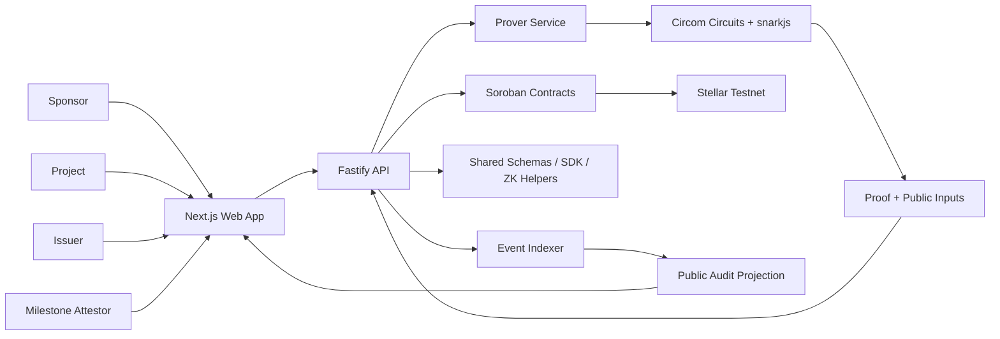

# Pact: Private Milestone Escrow

Pact is a Stellar/Soroban milestone escrow MVP that releases funding only when a project proves eligibility and milestone completion without revealing private business data.

The project combines:

- **Public accountability**: sponsors, projects, and observers can see escrow status, policy/root activation, proof submission, and tranche release events.
- **Private verification**: projects and attestors can prove that eligibility or milestone thresholds were satisfied without publishing raw KYB/KYC attributes, private evidence, or exact KPI values.
- **Programmable escrow**: Soroban contracts bind program, milestone, recipient, amount, policy, root, and nullifier checks before releasing a tranche.

The MVP is implemented as a full local/testnet demo with frontend, API, prover service, indexer skeleton, Circom circuits, TypeScript SDK/shared packages, and deployed Stellar testnet contracts.

## Problem

Milestone-based funding is common in grants, accelerators, venture programs, public goods funding, DAO treasuries, and regulated financial products. The usual tradeoff is weak:

- If all milestone evidence is public, projects may expose sensitive metrics, customers, revenue, audit documents, or compliance data.
- If milestone evidence is private, sponsors and public observers cannot independently trust that the release conditions were satisfied.
- If verification is handled manually, escrow release becomes slow, subjective, and difficult to audit.

Pact solves this by separating **what must be public** from **what must remain private**.

Public data includes program identity, policies, roots, proof status, nullifier usage, escrow funding, and tranche release. Private data includes raw KYB/KYC fields, raw milestone evidence, exact private KPI values, and credential secrets.

## How Pact Uses ZK

Pact uses zero-knowledge proofs to let a project prove that required conditions are true without revealing the underlying private inputs.

### What ZK Proves

Pact currently has two proof domains.

#### 1. Eligibility Proof

The project proves it satisfies an eligibility policy, for example:

- sanctions check passed
- credential is not expired
- project is accredited or non-US, depending on policy
- credential belongs to a published credential Merkle root
- proof is bound to the intended policy/context

The public verifier learns only that the credential satisfies the policy. It does not learn the raw KYB/KYC attributes.

#### 2. Milestone Unlock Proof

The project proves a milestone is complete, for example:

- `active_users >= 500`
- `pilot_partners >= 3`
- `audit_passed == true`
- milestone evidence belongs to a published milestone Merkle root
- proof is bound to the program, milestone, recipient, tranche amount, and policy

The public verifier learns only that the threshold passed. It does not learn the exact user count, exact partner list, private audit report, or raw source evidence.

### What Is Public

The following values are intentionally public because contracts and observers need them:

- policy hash
- root hash
- proof type
- program id
- milestone id
- recipient wallet
- tranche amount
- nullifier
- verification status
- release transaction hash

### What Stays Private

The following values are not exposed in public audit views:

- raw KYB/KYC fields
- credential secrets
- raw milestone metrics
- private evidence files or source references
- exact KPI values when only a threshold matters
- private witness inputs used by the circuits

### Concrete ZK Implementation

The MVP implements ZK with:

- **Circom circuits** in `circuits/eligibility-proof` and `circuits/milestone-unlock-proof`.
- **Groth16 / BN254** proving pipeline through `snarkjs`.
- **Merkle-root membership checks** for credential and milestone evidence roots.
- **Policy hash binding** so a proof is valid only for the intended policy.
- **Nullifier/context binding** so proofs cannot be replayed across programs, milestones, recipients, or amounts.
- **Public input formatting** in `packages/zk`.
- **Proof job orchestration** in `apps/api` and `apps/prover`.
- **Verifier adapter contract path** in `contracts/verifier-adapter`.

The MVP supports mock and digest verifier modes for demo/contract integration, while the circuit artifacts and local proving pipeline generate real Groth16-style proof artifacts for the eligibility and milestone circuits. Production hardening would replace remaining mock/demo verifier paths with a fully governed on-chain verifier flow and audited trusted setup process.

## Why This Matters

Pact turns private off-chain facts into public, auditable release conditions.

Instead of asking sponsors to trust a private report, the project can submit a proof. Instead of asking projects to publish sensitive operating metrics, the project can reveal only that the milestone condition is satisfied. Instead of making public observers trust a backend, Pact records escrow and verification state through contract-compatible artifacts and public audit projections.

The result is a funding workflow where privacy and accountability are not mutually exclusive.

## Real-World Applications

Pact can be adapted to:

- accelerator or grant programs that release capital after verified milestones
- DAO treasury funding with privacy-preserving milestone evidence
- public goods or impact funding where outcomes must be audited
- regulated investor participation where eligibility must be proven privately
- RWA or tokenized asset workflows that require compliance gates
- enterprise vendor or supplier payouts based on private performance evidence
- research, climate, or social impact programs where raw data is sensitive but threshold completion must be public

## Key Features

- Sponsor dashboard for program creation, funding, activation, and tranche status.
- Project dashboard for eligibility and milestone proof flows.
- Issuer console for mock credential creation, root building, publishing, and revocation.
- Attestor console for private milestone evidence validation and root publishing.
- Public audit view that hides private inputs while showing accountability events.
- Attack demo panel for replay, revoked credential, inactive root, cross-program, and wrong-recipient cases.
- Stellar testnet contract deployment artifacts.
- Local/testnet deployment verification scripts.
- TypeScript SDK and shared domain schemas.
- ZK fixtures, witness/proof scripts, and positive/negative circuit tests.

## Architecture



## Repository Structure

| Path | Purpose |
| --- | --- |
| `apps/web` | Next.js demo UI for sponsor, project, issuer, attestor, audit, and attacks. |
| `apps/api` | Fastify API, DTO validation, MVP services, Prisma schema. |
| `apps/prover` | Prover service, local/mock proof processing, worker skeleton. |
| `apps/indexer` | Event mapper, cursor store, public audit indexer skeleton. |
| `contracts` | Rust Soroban contracts and contract tests. |
| `circuits` | Eligibility and milestone Circom circuits, fixtures, proving scripts. |
| `packages/shared` | Constants, Zod schemas, DTOs, policy hashing. |
| `packages/sdk` | TypeScript API and Soroban client helpers. |
| `packages/zk` | Merkle helpers, fixtures, public input formatting. |
| `scripts/deploy` | Contract, off-chain, and frontend deployment checks. |
| `scripts/demo` | Happy path and attack scenario scripts. |
| `docs` | Scope, architecture, threat model, deployment runbook, final report. |

## Technical Stack

| Layer | Technology |
| --- | --- |
| Monorepo | `pnpm` workspace |
| Frontend | Next.js, React, TypeScript |
| API | Node.js, Fastify, Zod |
| Database model | PostgreSQL schema via Prisma |
| Queue | BullMQ-compatible `proof-jobs` queue |
| Contracts | Rust Soroban smart contracts |
| Network | Stellar testnet |
| ZK | Circom, snarkjs, Groth16, BN254 |
| Testing | Vitest, Playwright, Rust contract tests, Circom/snarkjs scripts |

## Implemented Contracts

| Contract | Responsibility |
| --- | --- |
| `PolicyRegistry` | Policy lifecycle and active policy checks. |
| `RootRegistry` | Credential/milestone root activation and current root reads. |
| `NullifierRegistry` | Replay protection through nullifier tracking. |
| `VerifierAdapter` | Mock/digest verifier modes and verifier configuration path. |
| `MilestoneEscrow` | Program lifecycle, funding, eligibility, milestone proof submission, tranche release. |
| `GatedAssetController` | Optional gated asset controller marker for future asset flows. |

Latest testnet deployment artifact: `contracts/deployments/latest.contracts.json`.

## Current Testnet Contract IDs

| Contract | Stellar testnet ID |
| --- | --- |
| PolicyRegistry | `CDVYEDPPQGMTRYWLTICHNB3WCNCYENSF4WCKJW5KYHJWFTHZQSTIW2TP` |
| RootRegistry | `CAZWJ4Y4ATQNZF237VVREHKMSC7PY622AJBDZIYURAP3DQO6PZPKTWWG` |
| NullifierRegistry | `CB22RLWPWAHXOWIBUEINDERPLWI6W4FNPRPYGXBXBRNGQPAJCWPWDAQG` |
| VerifierAdapter | `CDRIPSJMPQ3UNSSKDDJUXDHSY2FEEYQIUDKTNJN32EMCWOJW4SLKC3F3` |
| MilestoneEscrow | `CAFPMSEXS5GUJBTUGYZXL2FOOXKRJQMCFFAEMGXXDC5HFKXQLVVV4P5D` |
| GatedAssetController | `CDWKXDYQJEC442Z32LKJ2CDPWKFZXYAW67M24HADMSZDTNOKVZW4KAE4` |

Contract smoke evidence: `version()` returned `1` for the deployed PolicyRegistry contract.

## Main Demo Flow

1. Sponsor creates a program with tranches and policy references.
2. Sponsor funds and activates the program.
3. Issuer creates a mock KYB credential.
4. Issuer builds and publishes a credential Merkle root.
5. Project generates an eligibility proof.
6. Attestor validates hidden milestone evidence.
7. Attestor builds and publishes a milestone root.
8. Project generates a milestone unlock proof.
9. API validates public inputs against program, milestone, recipient, and amount.
10. Escrow releases the tranche.
11. Public audit view shows release evidence without private inputs.

## Attack Scenarios Covered

Pact includes scripted negative-path demonstrations:

- replayed milestone proof
- revoked credential
- inactive root
- cross-program replay
- wrong recipient

Run:

```bash
pnpm demo:attacks
```

## Getting Started

### Prerequisites

- Node.js 20+
- pnpm
- Rust toolchain for Soroban contracts
- Stellar CLI for contract deploy/invoke workflows
- Circom and snarkjs for circuit workflows

Install dependencies:

```bash
pnpm install
```

Create local environment:

```bash
cp .env.example .env
```

Real secrets must stay in `.env` or deployment secret storage. Do not commit secrets.

## Run the Local Test Demo

Start API:

```bash
APP_ENV=test API_HOST=127.0.0.1 API_PORT=4000 CORS_ORIGIN=http://127.0.0.1:3100 pnpm --filter @pact/api dev
```

Start prover in mock test mode:

```bash
APP_ENV=test PROVER_HOST=127.0.0.1 PROVER_PORT=4001 PROVER_MODE=mock PROVER_ENABLE_WORKER=false pnpm --filter @pact/prover dev
```

Start web:

```bash
NEXT_PUBLIC_APP_URL=http://127.0.0.1:3100 NEXT_PUBLIC_API_URL=http://127.0.0.1:4000 NEXT_PUBLIC_STELLAR_NETWORK=testnet pnpm --filter @pact/web dev --hostname 127.0.0.1 --port 3100
```

Open:

```text
http://127.0.0.1:3100
```

Health checks:

```bash
curl http://127.0.0.1:4000/health
curl http://127.0.0.1:4001/health
```

## Verification Commands

Happy path:

```bash
pnpm demo:happy-path
```

Attack scenarios:

```bash
pnpm demo:attacks
```

Off-chain deployment check:

```bash
pnpm deploy:offchain
```

Frontend build and Playwright smoke:

```bash
pnpm deploy:web
```

Circuit checks:

```bash
pnpm zk:test:eligibility
pnpm zk:test:milestone
```

Contract tests:

```bash
cd contracts
cargo test
```

## Deployment Artifacts

| Artifact | Purpose |
| --- | --- |
| `contracts/deployments/latest.contracts.json` | Latest Stellar testnet contract IDs. |
| `docs/deployment/offchain-services.latest.json` | API/prover/indexer deployment verification result. |
| `docs/deployment/frontend-demo.latest.json` | Frontend build and Playwright smoke result. |
| `docs/final-acceptance-checklist.md` | Final MVP acceptance evidence. |
| `docs/final-technical-report.md` | Full technical implementation report. |

## Security and Privacy Notes

- Public audit views intentionally hide raw KYB/KYC fields, raw milestone metrics, credential secrets, private source references, and private witness inputs.
- Proof public inputs are bound to policy, root, program, milestone, recipient, amount, and nullifier context.
- Replay attempts are rejected by release state and nullifier-oriented contract design.
- Revoked credentials and inactive roots are covered by negative-path tests.
- Real secret values are not committed.

## Current Limitations

- External public hosting is not configured; the frontend demo currently runs locally.
- API services use in-memory MVP state, with Prisma schema and migrations prepared for persistence.
- Docker daemon may be required for strict local Postgres/Redis verification.
- The event indexer has cursor and mapping coverage, but production Stellar RPC pagination and persistence hardening are future work.
- Full production on-chain Groth16 verifier governance and audited trusted setup remain hardening tasks.
- Issuer and attestor integrations are mock services in the MVP.

## Production Hardening Roadmap

- Move API services from in-memory MVP state to Prisma-backed persistence.
- Provision managed Postgres and Redis.
- Add production role-based auth for sponsor, project, issuer, attestor, and admin.
- Replace mock issuer and attestor flows with signed external integrations.
- Complete real asset issuance or final testnet/mainnet asset strategy.
- Harden Stellar event indexing with pagination, retries, idempotency, and DB persistence.
- Finalize verifier key governance and trusted setup process.
- Add CI for TypeScript, Rust, circuits, Playwright, deploy dry-run, and secret scanning.
- Configure public hosting, deployment secrets, monitoring, and incident runbooks.

## Project Status

The MVP is complete for local/testnet demonstration. It proves the core thesis: a milestone escrow can be publicly auditable while the eligibility and milestone evidence remain private through zero-knowledge proof workflows.
