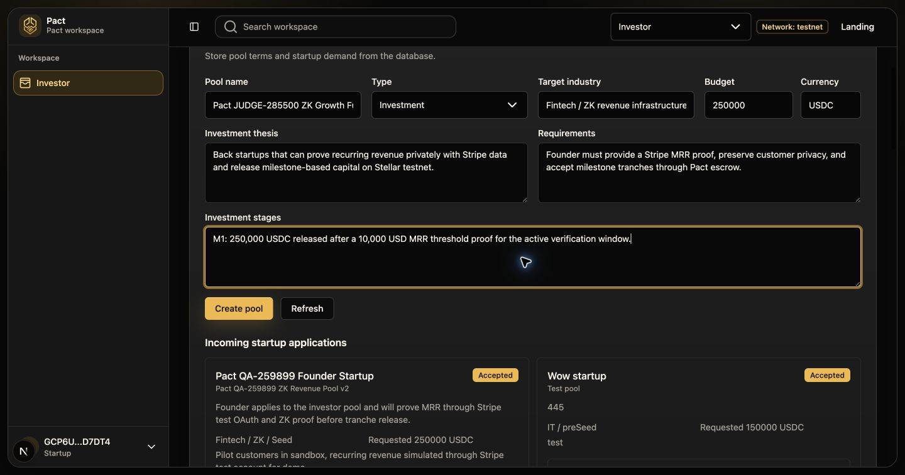
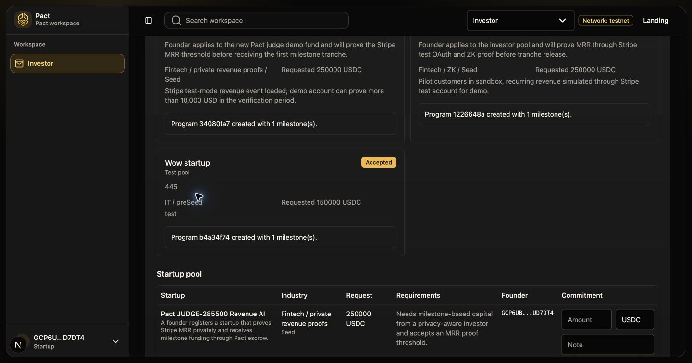
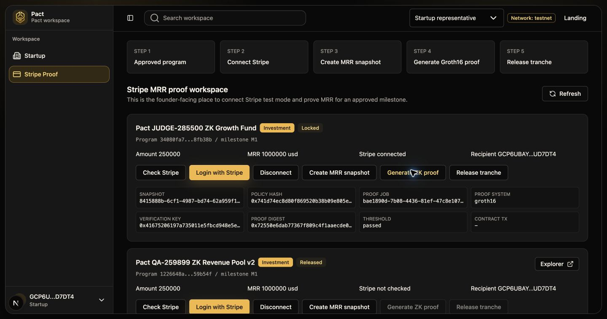
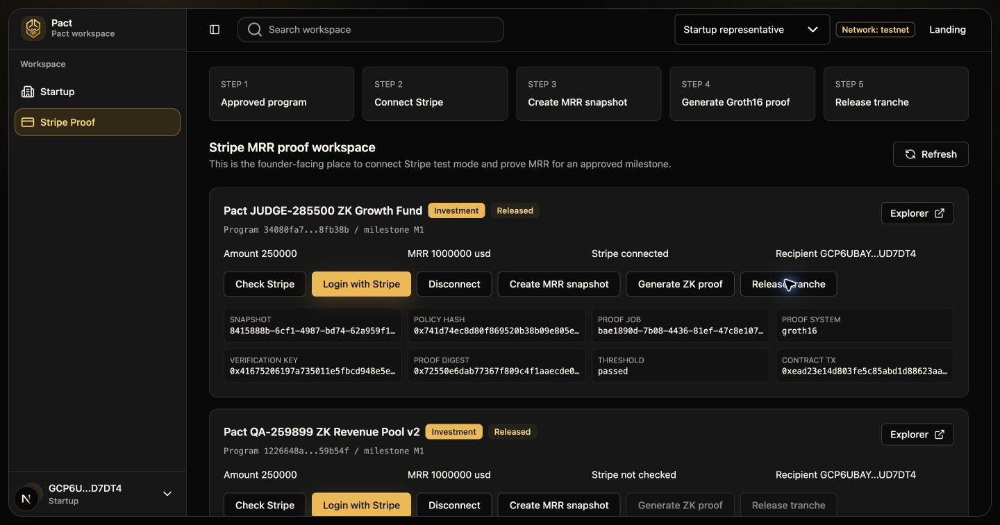
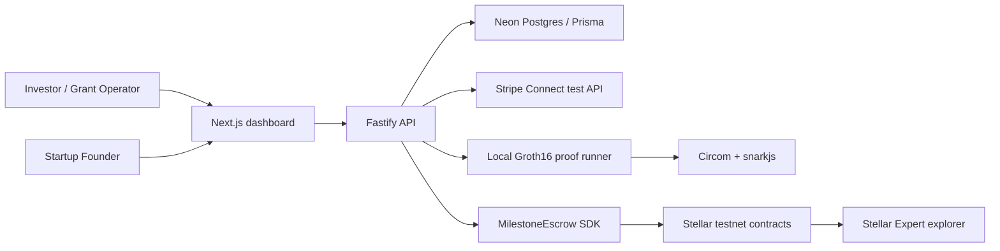

# Pact: Private Milestone Funding With ZK Proofs

Pact is a working Stellar testnet MVP for private milestone-based startup funding.

It lets investors or grant operators create funding pools, lets founders place startups and apply for capital, and releases milestone tranches automatically after a private business condition is proven with a zero-knowledge proof.

The current demo proves the full path:

- investor creates an investment pool;
- founder creates a startup profile and applies;
- investor approves the startup and defines an MRR milestone;
- Pact creates, funds, and activates a Stellar testnet escrow program;
- founder connects a Stripe test account;
- Pact reads real Stripe test-mode revenue data;
- Pact creates a redacted MRR snapshot;
- Pact generates and verifies a local Groth16 proof;
- Pact submits digest-bound proof attestations on-chain;
- the `MilestoneEscrow` contract releases the tranche automatically.

Full visual proof report:

[Open the end-to-end scenario report](docs/interface-scenario-visual-report-2026-07-03.html)

## Why Pact Matters

Startup funding, grants, and accelerator programs often require sensitive evidence: revenue, customer traction, compliance status, payment records, or audit data. Publishing that data is risky. Hiding it completely makes investor approval and tranche release hard to trust.

Pact separates private evidence from public accountability.

Founders prove that a milestone is true without exposing the underlying private records. Investors and judges can still verify program creation, escrow funding, proof submission, and tranche release through public Stellar testnet transactions.

## Judge Demo Highlights

| Capability | Current status |
| --- | --- |
| Role-specific founder and investor dashboards | Implemented |
| Investor pool creation | Implemented with database persistence |
| Founder startup profile creation | Implemented with database persistence |
| Startup application to investment pool | Implemented |
| Investor approval with milestone terms | Implemented |
| Stellar testnet program creation | Implemented |
| Stellar testnet escrow funding | Implemented with demo SAC token transfer |
| Stripe Connect OAuth test-mode flow | Implemented |
| Real Stripe test payment data snapshot | Implemented |
| Local Groth16 proof generation | Implemented |
| Off-chain Groth16 verification | Implemented |
| On-chain proof digest attestation | Implemented |
| Automatic smart-contract tranche release | Implemented |
| Stellar Explorer links for every on-chain step | Included in the report and below |

## Interface Screenshots

Investor creates the investment pool:



Investor approves the startup and Pact creates the on-chain program:



Founder generates the Groth16 proof:



Founder receives the released tranche:



## Real Demo Evidence

The latest captured scenario uses these records:

| Item | Value |
| --- | --- |
| Investment pool | `Pact JUDGE-285500 ZK Growth Fund` |
| Startup | `Pact JUDGE-285500 Revenue AI` |
| Program ID | `34080fa7-c418-47b5-89aa-ce92258fb38b` |
| Milestone | `M1` |
| Approved tranche | `250000 USDC` |
| Stripe threshold | `1000000` cents, `usd` |
| Stripe snapshot | `8415888b-6cf1-4987-bd74-62a959f18745` |
| Snapshot commitment | `0xec71387e978a758296d5ce047e3a0fba9480734d4c571cf69809a4213c147489` |
| Proof job | `bae1890d-7b08-4436-81ef-47c8e107e6c8` |
| Proof system | `groth16` |
| Verification key hash | `0x41675206197a735011e5fbcd948e5e85914d6b937e4fb3308c06e853615c93d0` |
| Proof digest | `0x72550e6dab77367f809c4f1aaecde0f66b222589533ac1c0830d4c1ee78cefec` |
| Final tranche status | `Released` |
| Final release tx | [`0xead23e14d803fe5c85abd1d88623aa1466c3ed392da61da75529f37d8f51b81b`](https://stellar.expert/explorer/testnet/tx/ead23e14d803fe5c85abd1d88623aa1466c3ed392da61da75529f37d8f51b81b) |

## How The ZK Flow Works

Pact does not publish the raw Stripe account ID, raw charges, customer data, source references, or private witness values.

Instead, the API fetches real Stripe test-mode payment data for the connected account and creates a private revenue snapshot. The public side receives only commitments and policy values:

- connected account hash;
- policy hash;
- snapshot commitment;
- source reference commitment;
- threshold amount;
- currency;
- period start and end;
- nullifier;
- ordered public inputs.

The local proof runner then generates a Groth16 proof over the revenue-threshold circuit and verifies it off-chain with `snarkjs`. The successful proof produces:

- `proofSystem = groth16`;
- `verified = true`;
- verification key hash;
- proof digest;
- ordered public inputs.

For the MVP, Pact uses a digest-attestation model on-chain:

1. Groth16 proof is generated locally.
2. Groth16 proof is verified off-chain.
3. Pact canonicalizes the proof and public inputs.
4. Pact computes the proof digest.
5. Pact submits digest-bound public inputs to `MilestoneEscrow`.
6. `MilestoneEscrow` checks active policy, active root, nullifier, milestone, recipient, amount, and digest binding.
7. The contract releases the tranche only after the proof path marks the milestone ready.

This release is not simulated. The tranche release is a real Stellar testnet transaction, and every on-chain operation is linked below.

## Stellar Testnet Transactions

All links open in Stellar Expert testnet explorer.

| # | Operation | Transaction |
| --- | --- | --- |
| 1 | Create escrow program | [`0x384c47c7d44cb0cdccfbcc4e288ade4b2220bcbf8cce39f8ed730107539e0301`](https://stellar.expert/explorer/testnet/tx/384c47c7d44cb0cdccfbcc4e288ade4b2220bcbf8cce39f8ed730107539e0301) |
| 2 | Add M1 tranche | [`0xbee011318593d47ab59d9afbfbb8e5101021f70406012c2ec83b678cb862c15a`](https://stellar.expert/explorer/testnet/tx/bee011318593d47ab59d9afbfbb8e5101021f70406012c2ec83b678cb862c15a) |
| 3 | Fund escrow with demo SAC asset | [`0x145a2344b1ca49c2a24c519b71494a143792b895e608c53488b82544717e2289`](https://stellar.expert/explorer/testnet/tx/145a2344b1ca49c2a24c519b71494a143792b895e608c53488b82544717e2289) |
| 4 | Activate funded program | [`0xf6af69f57d85b742afb0e7de2f16014f08c32742c07087909b37609507228e46`](https://stellar.expert/explorer/testnet/tx/f6af69f57d85b742afb0e7de2f16014f08c32742c07087909b37609507228e46) |
| 5 | Set verifier mode to Groth16 digest | [`0x8af07da39475b803db702f2019cffaa178b48f64fc515c72db781fa81f97e185`](https://stellar.expert/explorer/testnet/tx/8af07da39475b803db702f2019cffaa178b48f64fc515c72db781fa81f97e185) |
| 6 | Activate eligibility policy | [`0x22e99e7d839667a731d6c233e78dd8050bd34de42e37e618a5e7cb048b0326cd`](https://stellar.expert/explorer/testnet/tx/22e99e7d839667a731d6c233e78dd8050bd34de42e37e618a5e7cb048b0326cd) |
| 7 | Activate eligibility root | [`0x51bce17d451b07bd3b019742c68a1e7b8c0a0afe9bf87b91aad443312094caf8`](https://stellar.expert/explorer/testnet/tx/51bce17d451b07bd3b019742c68a1e7b8c0a0afe9bf87b91aad443312094caf8) |
| 8 | Submit eligibility digest attestation | [`0xf766a8607d369f99fdf495e81326e39e8f8890eee18dcded97647dba5b6f9f08`](https://stellar.expert/explorer/testnet/tx/f766a8607d369f99fdf495e81326e39e8f8890eee18dcded97647dba5b6f9f08) |
| 9 | Activate milestone policy | [`0xee574751fc2a7f71dbdeb8382734e47e4a9684ef155f672d3b2f67dbd14b0664`](https://stellar.expert/explorer/testnet/tx/ee574751fc2a7f71dbdeb8382734e47e4a9684ef155f672d3b2f67dbd14b0664) |
| 10 | Activate Stripe snapshot root | [`0xf567afdfe1c02b17d0d8cf08df4d22dbfe9f0533f7e232065d7328215ec7dd73`](https://stellar.expert/explorer/testnet/tx/f567afdfe1c02b17d0d8cf08df4d22dbfe9f0533f7e232065d7328215ec7dd73) |
| 11 | Submit MRR proof digest attestation | [`0xd9a99746e97b6c770bce4aa81d376551a8b98fed1f465dd888ea6c59bae3721f`](https://stellar.expert/explorer/testnet/tx/d9a99746e97b6c770bce4aa81d376551a8b98fed1f465dd888ea6c59bae3721f) |
| 12 | Release tranche to founder wallet | [`0xead23e14d803fe5c85abd1d88623aa1466c3ed392da61da75529f37d8f51b81b`](https://stellar.expert/explorer/testnet/tx/ead23e14d803fe5c85abd1d88623aa1466c3ed392da61da75529f37d8f51b81b) |

## Current Testnet Contracts

Latest deployment artifact:

`contracts/deployments/latest.contracts.json`

| Contract | Stellar testnet ID |
| --- | --- |
| PolicyRegistry | `CBYOVZI66Z46OM5HVKLUVCYQLFESGQ7NLLFBHTQAI7AB4DCYCLGL2P4Y` |
| RootRegistry | `CCG3CM6UBLCHESYMSFYLFV6JNA22LM5U6PB3BUJPRT3Q2OHGCILNW356` |
| NullifierRegistry | `CADRYB5M6ZBZTGAOXE6GMYOQNHUL3XJDVWS33KFSOCULJ44LQ7YNUEGH` |
| VerifierAdapter | `CAPP7AEL6QHEVODGZRSZPGO2ZS5K7FLKUTVI57ABYT4AXMSTMZPXONQS` |
| MilestoneEscrow | `CDBIYLEX767RXTGPIALHY2M65SVUWRHDEYHMOWJR55CTETS4CASMGILZ` |
| Demo SAC asset | `CDPIXI6CEJ7JJURHKGDPJPYUXOZC4QT5V46JHQL6QB5A4X4KPMH2FXVQ` |
| GatedAssetController | `CBJBLO5L37CSP3OPAZAIVH6TQS6N7XVZA2MQM5IBHGJEFHHNQE4RICEP` |

## Product Surface

| Role | Implemented interface |
| --- | --- |
| Founder | Startup profile creation, available pools and grants, applications, approved programs, Stripe MRR proof workspace, tranche release receipt. |
| Investor | Investment/grant pool creation, startup pool review, incoming applications, approval with milestone editor, commitments, owned pools. |
| Admin | Combined marketplace/admin surfaces for reviewing both founder and investor flows. |
| Public audit | Contract events, proof receipts, tx hashes, and redacted public evidence. |

## Architecture



## Repository Structure

| Path | Purpose |
| --- | --- |
| `apps/web` | Next.js role-aware dashboard and landing/demo surfaces. |
| `apps/api` | Fastify API, Prisma persistence, marketplace, Stripe connector, proof orchestration, contract runtime. |
| `contracts` | Rust Soroban contracts and testnet deployment artifacts. |
| `circuits` | Circom circuits and snarkjs proof pipeline. |
| `packages/shared` | DTOs, schemas, status enums, shared contracts. |
| `packages/sdk` | TypeScript Soroban clients and SDK helpers. |
| `packages/zk` | ZK public input and helper utilities. |
| `docs` | Final visual walkthrough report and its screenshots. |

## Run Locally

Use the existing `.env` values for the configured Neon database, Stripe test mode, Stellar testnet contracts, and local Stellar CLI.

API:

```bash
pnpm --dir apps/api dev
```

Web:

```bash
pnpm --filter @pact/web dev --hostname 127.0.0.1 --port 3000
```

Open:

```text
http://localhost:3000
```

Targeted checks used during the final demo:

```bash
pnpm --filter @pact/api typecheck
pnpm --filter @pact/web typecheck
```

## Demo Artifacts

| Artifact | Purpose |
| --- | --- |
| `docs/interface-scenario-visual-report-2026-07-03.html` | Full visual walkthrough with screenshots and Stellar Explorer links. |
| `docs/interface-scenario-screenshots-2026-07-03/` | Captured UI screenshots used by the walkthrough. |

## Honest MVP Boundary

Pact already demonstrates a real end-to-end local/testnet product path: database-backed marketplace, Stripe-backed revenue snapshot, local Groth16 proof generation and verification, on-chain digest attestation, escrow funding, and automatic tranche release.

The current MVP uses off-chain Groth16 verification with on-chain digest attestation. A production version should add audited verifier governance, stronger key ceremony documentation, production event indexing, hosted infrastructure, and external KYB/attestation providers.

The core thesis is proven: private business evidence can unlock public, auditable milestone funding without exposing sensitive startup data.
